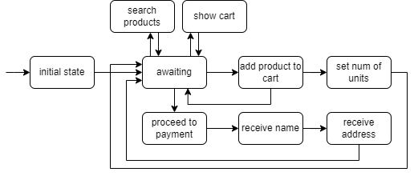

# Chatbot Activities

[BESSER Bot Framework](https://github.com/BESSER-PEARL/BESSER-Bot-Framework) (BBF)

[Documentation](https://besserbot-framework.readthedocs.io/en/latest/)


## Project setup

- You will need a Python version >= 3.10
- Clone this repository
- Create a new project in your IDE.
- We recommend to create a virtual environment for the exercises (e.g. [venv](https://docs.python.org/3/library/venv.html),
  [conda](https://conda.io/projects/conda/en/latest/user-guide/tasks/manage-environments.html))
- Then, you will install the dependencies, containing the BESSER Bot Framework:
```bash
pip install -r requirements.txt
```

- You can check if the installation was properly done by running an example bot in the BBF library. You can try to run the Greetings Bot:

```bash
from besser.bot.test.examples.greetings_bot import bot

bot.run()
```

## Activity 1: Creating a chatbot

In this activity you will create a simple chatbot simulating an e-commerce shop. Its state machine would look like this:



We will divide the problem into different steps to incrementally add functionalities to the chatbot until we end up with the final result.

The chatbot code will be written in the [shop_bot.py](shop_bot.py) script. Once you open it, you will see some code we provide you to start with the bot development.

- We created a simple Product class. Each product has a name, some tags and a price.
- There is a dictionary containing a set of pre-defined products (you can add other products if you want)
- Then, you will see the instantiation of the bot and the WebSocket platform, which is in charge of sending and receiving messages to and from the bot.
- Then, there are 2 entities: product_entity and tag_entity. They contain the product names and all the tags, respectively.
  (We could have created these entities from scratch, but instead, they automatically get the values from the products dictionary)
  These entities will be used as intent parameters later.
- Finally, you will see the instantiation of all the bot states as shown in the previous diagram.
- At the bottom of the script, the bot.run() function to run the bot.


### 1.1 Create the intents

First of all, you will define the intents the bot will be able to recognize. You will need to provide example sentences for each intent,
that the bot will use as training data. Try to imagine how the user interaction with the bot should be, and define the appropriate intents to transition to each state (some transitions may not be triggered by intent matching)

Some intents may have parameters, that will be accessible from the bot states. Try thinking which intents would need some parameter (i.e. entity)

(the [initial state] --> [awaiting] transition is automatic. The initial state will be run only once when a user establishes connection and its purpose is to initialize some user data.)

You can also skip this part and implement the intents "on demand" while working on the next exercise.

--> https://besserbot-framework.readthedocs.io/en/latest/wiki/core/intents.html

### 1.2 Create the state bodies and transitions

Each state has a python function (what we call the body of the state), and it will be run for each user whenever they transition to some states.

For instance, when user X moves to 'search_products_state' (once the intent 'search_products_intent' is recognized from the 'awaiting_state') the body associated to 'search_products_state' will be executed with the session of user X as parameter

Check the BBF docs to see how to define a state body --> https://besserbot-framework.readthedocs.io/en/latest/wiki/core/states.html

1. Create the body for **initial_state** and an automatic transition from initial_state to awaiting_state (https://besserbot-framework.readthedocs.io/en/latest/wiki/core/transitions.html)
   initial_state's body will create a new object in the user session. We will call it 'cart' and it will be an empty dictionary. See how to do it --> https://besserbot-framework.readthedocs.io/en/latest/wiki/core/sessions.html
   
   From initial_state, the bot will also send a message to the user: "Welcome to the shop!"
2. Create the body for **awaiting_state**, where the bot simply sends a message "How can I assist you?". Then, you must define
   the transitions from awaiting_state to the corresponding states based on the intent matched from this state (see the bot diagram above)
3. Create the body for **show_cart_state**. Its body must get the user cart from the session and show a Pandas DataFrame (a table) with the columns
   'name', 'price' and 'quantity', and one row for each kind of product in the cart. At this point, the cart will always be empty until we implement the states to add products.
   The cart dictionary will contain an entry for each kind of product, where the key is the product name and the value is the number of units. After the execution of this state, the bot should return to the awaiting_state.
4. Now, do the same with **search_products_state**. This body should extract the detected intent parameter. (Suggestion: this state could be useful to search products based on a tag. Therefore, this body should extract the tag parameter from the intent and search on the products dictionary those with that tag.
   Make sure the defined intent has a parameter!)
5. Now, let's implement the states to **add products to the cart**. The proposed workflow is as follows: a user can request to add a specific number of units of a product
   (e.g. "add 5 Macbooks to the cart"). Then, 5 units of that product are added to the user cart and the bot goes back to awaiting_state.
   If the user does not specify the number of units (e.g. "Add Macbook to cart"), the bot will ask for the number of units of that product, then will move to another state (set_num_units_state) to store the product into the cart, and will go back to awaiting_state.
6. Finally, let's implement the **proceed_payment_state**, where the purchase is confirmed and the cart gets empty. Feel free to experiment here with other BBF features, like replying with buttons (see the [docs](https://besserbot-framework.readthedocs.io/en/latest/wiki/platforms/websocket_platform.html)) (e.g. "do you want to confirm the purchase?" [yes] [no])

### 1.3 Extra exercise

So far, the bot has been using the default intent classifier (SimpleIntentClassifier). BBF includes LLM-based intent classifiers that can rely on OpenAI or HuggingFace LLMs.
You can read the [intent classifier docs](https://besserbot-framework.readthedocs.io/en/latest/wiki/nlp/intent_classification.html) to learn how to use it and try to use the HuggingFace LLM-based Intent Classifier in the awaiting_state (since this one is the most complex to recognize the user intent).
It only requires you to create a HF account and generate a token to use the API. Then, in the [config.ini](config.ini) file you can set your HF API key and the desired LLM to use (you can try with mistralai/Mixtral-8x7B-Instruct-v0.1)

As explained in the docs, the LLMIntentClassifier works with simple intent descriptions, without the need of intent training sentences.


### 1.4 Extra exercise

What happens when the bot does not recognize the user intent?

Each state has a body function, but also a fallback body function. It will be run when the intent is not recognized (among other possible errors that may occur during the bot execution)

For example, when the bot is in awaiting_state and the user message is not properly classified into one of the defined intents, the fallback body of awaiting_state will be executed, and the bot will then wait for another user message.

Read the docs to learn how to define a custom fallback method for a specific state --> https://besserbot-framework.readthedocs.io/en/latest/wiki/core/states.html#state-fallback-body

As an optional exercise, you can create a fallback body for awaiting_state that will send the user message to an LLM (e.g. to a HuggingFace LLM through its free API), and the generated answer by the LLM will be replied to the user.
You can send the user query to the LLM with additional context (e.g. "You are a shopping assistant. I want you to help a user, who sent me this message...")

This documentation may help you do this exercise --> https://huggingface.co/docs/api-inference/detailed_parameters#text-generation-task

## Activity 2: Creating a chatbot generator

In the previous exercise, you learned how to create a chatbot from scratch with the help of the BBF low-code features, where you simply had to worry about the bot logics.

Now, you will follow a no-code approach where the chatbots will be automatically generated from a csv file.

The [bot_generation](bot_generation) package contains the code of a GUI that allows you to upload a csv file, generate a chatbot with that file and use all the generated chatbots.

To run it, simply:
```bash
streamlit run bot_generation.py
```
(Streamlit allows you to run updated python code without rerunning the program. Simply refresh the browser and it will run your updated code.)

You will see a form to import a csv file. As an example, see the [sample_data.csv](bot_generation%2Fsample_data.csv) we provide.

The csv structure is 2 columns (question and answer), where multiple questions can result in the same answer (that is why there are questions with no answer in the sample data)

Your task is to implement the function generate_bot() in [bot_generator.py](bot_generation%2Fgenerator%2Fbot_generator.py). It is called every time you press the 'Generate bot' button.
This function receives as arguments the bot name and the pandas DataFrame containing the csv content. You need to create a JSON-like object
(a Python dictionary) containing the necessary information to generate a bot script, similar to the one you created in the previous exercise.

To generate the bot, you will have to crate a Jinja template, filling the file [bot_generation.py.j2](bot_generation%2Fgenerator%2Fbot_generation.py.j2) with the bot template (i.e. a Python code template).
This template will be filled thanks to parameters (those you will store in the dictionary, based on the csv content), such as the intents or the states.

The generated chatbots will have a "central" state and one state for each kind of question in the csv file. The central state
will be the entry point to receive any of the questions provided in the csv file. The other states will be in charge of replying the answers to the user.

Some tips to use Jinja template:

Example JSON data used to fill the template:

```
data = {
    'elements': [
        {
            'name': 'e1',
            'value': True
        },
    ]
}
```

How to create loops:

```

 Your code here

```

How to access elements in the JSON data:

```
{{ element.name }}
```

You can use these delimiters to generate your bot code based on the csv file data.

The generated bot scripts will be stored in the [bots](bot_generation%2Fbots) package.